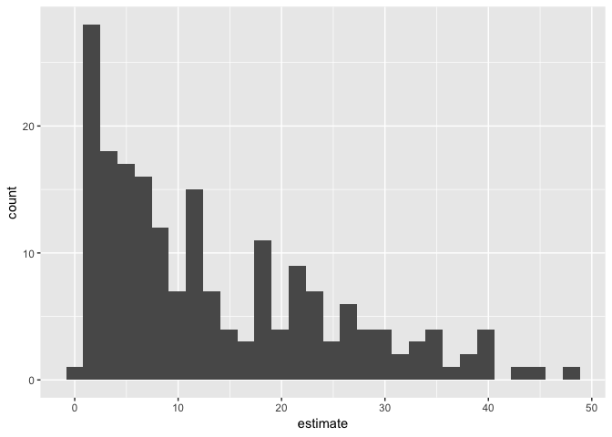
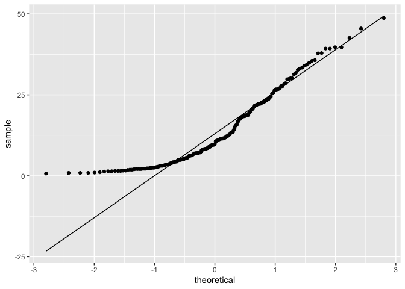
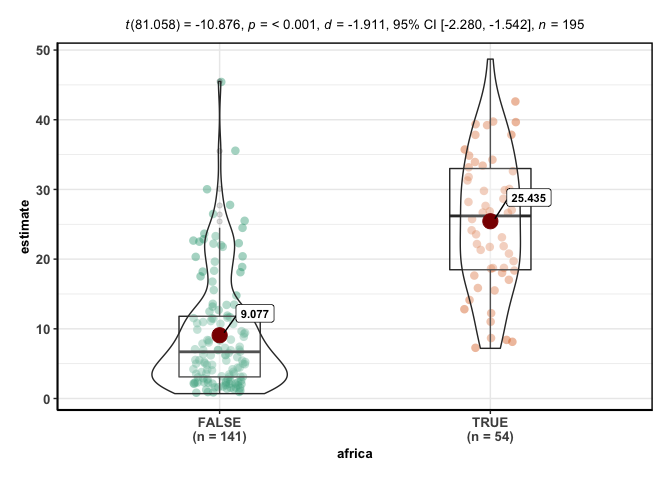
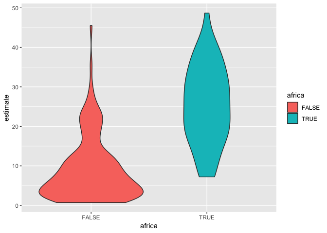
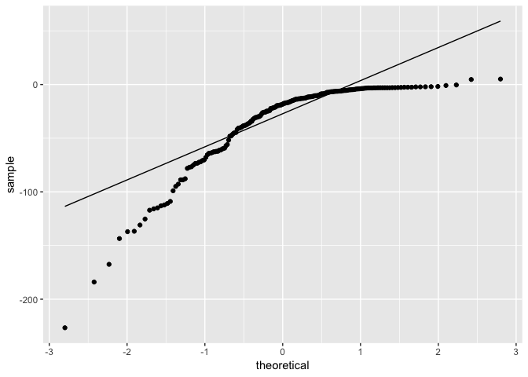
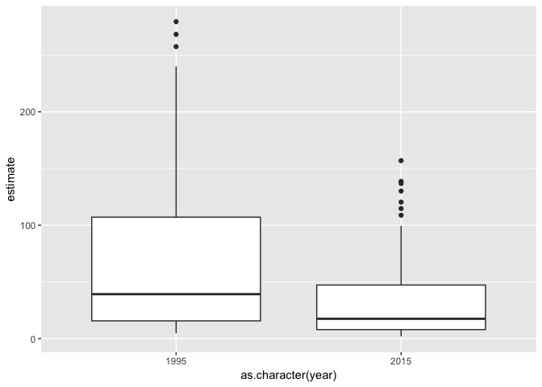
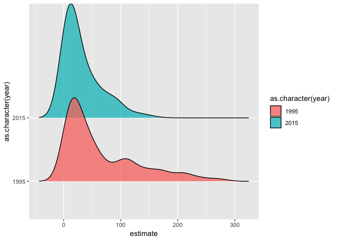

Lab 07 Replication File
================
Christopher Prener, Ph.D.
(October 28, 2018)

## Introduction

This is the replication file for Lab 07, which covers difference of
means testing in `R`.

## Dependencies

This notebook requires functions from a variety packages:

``` r
# tidyverse packages
library(broom)        # tidy output
library(dplyr)        # wrangling data
```

    ## 
    ## Attaching package: 'dplyr'

    ## The following objects are masked from 'package:stats':
    ## 
    ##     filter, lag

    ## The following objects are masked from 'package:base':
    ## 
    ##     intersect, setdiff, setequal, union

``` r
library(ggplot2)      # plots
library(readr)        # read/write csv files
library(tidyr)        # reshping data

# statistical packages
library(car)          # statistical testing
```

    ## Loading required package: carData

    ## 
    ## Attaching package: 'car'

    ## The following object is masked from 'package:dplyr':
    ## 
    ##     recode

``` r
library(effsize)      # effect size calculations
library(ggridges)     # ridge plots
```

    ## 
    ## Attaching package: 'ggridges'

    ## The following object is masked from 'package:ggplot2':
    ## 
    ##     scale_discrete_manual

``` r
library(ggstatsplot)  # statistical plots
library(moments)      # normality testing
library(nortest)      # normality testing
library(pwr)          # power and sample size calculations

# data packages
library(testDriveR)

# other packages
library(here)         # file path management
```

    ## here() starts at /Users/chris/GitHub/SOC5050/LectureRepos/lecture-08/assignments/lab-07-replication

## Load Data

We’ll start by loading the data from the updated `testDriveR` package
into a new data frame called `mortality`.

``` r
mortality <- childMortality
```

## Part 1: Data Preparation

### Question 1

We are specifically interested in highlighting African nations. The
following code creates the logical variable for African
nations:

``` r
mortality <- mutate(mortality, africa = ifelse(continent == "Africa", TRUE, FALSE))
```

### Question 2

Question 2 asks you to subset the data so that we highlight a particular
series of observations. These data contain multiple years worth of
information, and we want to pull out observations that meet two
criteria. We can do this two ways, both of which involve the `filter()`
function. The first technique uses pipes and two calls of `filter()`,
one for each condition. The output is passed to a new object called
`neonate15`.

``` r
mortality %>%
  filter(year == 2015) %>%
  filter(category == "neonate_MR") -> neonate15
```

The second technique uses the logical operator `&` (“and”) to connect
both the `year` and `category` conditions into a single call of
`filter()`.

``` r
neonate15 <- filter(mortality, year == 2015 & category == "neonate_MR") 
```

Both techniques produce the same ultimate output. I tend to think the
second approach is easier to read if there are only two conditions. When
the condition statements get more complex, it is advisable to break them
up into different calls of `filter()`. We now have long-formatted data
that can be used for plotting.

Finally, we want to write our data to the `data/` subdirectory:

``` r
write_csv(neonate15, here("data", "neonate15.csv"))
```

### Question 3

Question 3 asks you to make a second subset of the data. Like the
previous question, we can accomplish this in two ways. The first uses
pipes and two calls of `filter()`.

``` r
mortality %>% 
  filter(year == 1995 | year == 2015) %>%
  filter(category == "under5_MR") -> mortality05
```

The second technique uses two logical operators - `&` (“and”) and `|`
(“or”) to accomplish the same output in a single line of code. Note
how parentheses are used to introduce order of operations rules into the
call.

``` r
mortality05 <- filter(mortality, (year == 1995 | year == 2015) & category == "under5_MR") 
```

Again, both approaches work. With this example, however, you start to
see how layering additional complexity in a single `filter()` can make
it harder to understand intuitively what is happening in the function.
We now have long-formatted data that can be used for plotting.

Finally, we want to write our data to the `data/` subdirectory:

``` r
write_csv(neonate15, here("data", "mortality05.csv"))
```

### Question 4

Finally, we want to convert our data, which are long, to wide. We use
`select()` to pull out the critical variables and then `spread()` to
convert those data to wide. We’ll also save these data to a `csv` file:

``` r
mortality05 %>%
  select(countryName, year, estimate) %>%
  spread(key = year, value = estimate) %>%
  rename(u5_1995 = `1995`,
         u5_2015 = `2015`) -> mortality05_wide

write_csv(neonate15, here("data", "mortality05_wide.csv"))
```

This creates a spreadsheet-like format for our data that can be used for
hypothesis testing.

## Part 2: One-sample T Test

### Question 5

The following function will give us the average number of neno-natal
deaths:

``` r
mean(neonate15$estimate)
```

    ## [1] 13.60667

The units here are rates - these are the number of fatalities per 1,000
live births in each country. On average, there were 13.607 deaths per
1,000 live births in 2015.

### Question 6

We can test whether these data are drawn from a population has a value
of \(\mu = 15\) using a one-sample t test.

``` r
t.test(neonate15$estimate, mu = 15)
```

    ## 
    ##  One Sample t-test
    ## 
    ## data:  neonate15$estimate
    ## t = -1.728, df = 194, p-value = 0.08558
    ## alternative hypothesis: true mean is not equal to 15
    ## 95 percent confidence interval:
    ##  12.01639 15.19694
    ## sample estimates:
    ## mean of x 
    ##  13.60667

The results of the one-sample t test (\(t = -1.728, p = .086\)) suggest
that these data (\(\bar{x} = 13.607\)) could indeed have been drawn from
a population that has a mean of 15 (since the results were *not*
statistically significant).

We’ll write these results to a `csv` file:

``` r
t.test(neonate15$estimate, mu = 15) %>%
  tidy() %>%
  write_csv(here("results", "p2_q06_oneSample15.csv"))
```

I’ve written this more succinctly than I have in the past - I pipe the
`t.test()` call into a `tidy()` function to create the tibble containing
the t test output and then pipe that output into a `write_csv()` call.
This functionally is the same as:

``` r
results <- t.test(neonate15$estimate, mu = 15)
results <- tidy(results)
write_csv(results, here("results", "p2_q5_oneSample15.csv"))
```

It is also easier to read but less succinct than this alternative
pipeline:

``` r
tidy(t.test(neonate15$estimate, mu = 15)) %>%
  write_csv(here("results", "p2_q06_oneSample15.csv"))
```

Here, because `t.test()` is wrapped in `tidy()`, we get a pipeline is
that is a line shorter than the previous pipeline, but is higher to
read. There is often a tradeoff between readability and how succinctly
code is written - strive for a balance in your analysis notebooks.

### Question 7

We can test whether these data are drawn from a population has a value
of \(\mu = 12\) using a one-sample t test.

``` r
t.test(neonate15$estimate, mu = 12)
```

    ## 
    ##  One Sample t-test
    ## 
    ## data:  neonate15$estimate
    ## t = 1.9926, df = 194, p-value = 0.04771
    ## alternative hypothesis: true mean is not equal to 12
    ## 95 percent confidence interval:
    ##  12.01639 15.19694
    ## sample estimates:
    ## mean of x 
    ##  13.60667

The results of the one-sample t test (\(t = 1.993, p = .048\)) suggest
that these data (\(\bar{x} = 13.607\)) are not likely to be drawn from a
population that has a mean of 12 (since the results *were* statistically
significant.)

We’ll write these results to a `csv` file as well:

``` r
t.test(neonate15$estimate, mu = 12) %>%
  tidy() %>%
  write_csv(here("results", "p2_q07_oneSample12.csv"))
```

## Part 3: Independent T Test

### Question 8

We can test one of the key assumptions of the independent t test with
the Levene’s test, which assesses homogeneity of variance. The following
code calculates that test using the `leveneTest()`
    function:

``` r
leveneTest(estimate ~ africa, data = neonate15)
```

    ## Warning in leveneTest.default(y = y, group = group, ...): group coerced to
    ## factor.

    ## Levene's Test for Homogeneity of Variance (center = median)
    ##        Df F value Pr(>F)  
    ## group   1  6.5261 0.0114 *
    ##       193                 
    ## ---
    ## Signif. codes:  0 '***' 0.001 '**' 0.01 '*' 0.05 '.' 0.1 ' ' 1

The results of the Levene’s test (\(f = 6.526, p = .011\)) suggest that
the homogeneity of variance assumption does not hold. The variance in
neonatal mortality rates among African nations is substantively
different from the variance in neonatal mortality rates among
non-African countries.

We’ll write these results to a `csv` file:

``` r
leveneTest(estimate ~ africa, data = neonate15) %>%
  tidy() %>%
  write_csv(here("results", "p3_q08_levene.csv"))
```

    ## Warning in leveneTest.default(y = y, group = group, ...): group coerced to
    ## factor.

### Question 9

The other assumptions of the independent t test are as follows:

1.  The dependent variable, `estimate`, is indeed continuous
2.  The dependent variable, `estimate`, should not be considered
    normally distributed (see code and explanation below). *This
    violates one of the assumptions\!*
3.  The homogeneity of variance assumption also does not hold.
4.  The observations are independent - there is not a clear causal
    relationship between one country’s neonatal mortality rate and
    another’s (at least not a simple causal relationship).

#### Testing Normality

We can start by easily calculating descriptive statistics using the
`summary()` function:

``` r
summary(neonate15$estimate)
```

    ##    Min. 1st Qu.  Median    Mean 3rd Qu.    Max. 
    ##    0.70    4.25    9.80   13.61   21.75   48.70

Note how half the observations are below the median value of 9.8, but
there is a *long* right tail that stretches to nearly 50.

We can see this reflected in a histogram of these data. To simplify the
workflow, we’ll save our `ggplot` object in our enviornment, save it,
and then display it:

``` r
# create plot object
plot <- ggplot(data = neonate15, mapping = aes(estimate)) + 
  geom_histogram()

# save plot
ggsave(here("results", "neonate15_histogram.png"), plot = plot, dpi = 300)
```

    ## Saving 7 x 5 in image

    ## `stat_bin()` using `bins = 30`. Pick better value with `binwidth`.

``` r
# print plot
plot
```

    ## `stat_bin()` using `bins = 30`. Pick better value with `binwidth`.

<!-- -->

Surprisingly, the right tail seen above in the histogram is not
reflected as strongly in the skewness and kurtosis assessments:

``` r
skewness(neonate15$estimate)
```

    ## [1] 0.9116872

``` r
kurtosis(neonate15$estimate)
```

    ## [1] 2.951793

Both of these values suggest a variable that is roughly normally
distributed, if slightly platykurtic in nature.

The qqplot shows us the degree of the departure from normality on the
left side of the distribution:

``` r
# create plot object
plot <- ggplot(data = neonate15, mapping = aes(sample = estimate)) +
  stat_qq() +
  stat_qq_line()

# save plot
ggsave(here("results", "neonate15_histogram.png"), plot = plot, dpi = 300)
```

    ## Saving 7 x 5 in image

``` r
# print plot
plot
```

<!-- -->

This plot conflicts with the skew and kurtosis values, but given the
histogram above, I would give the qqplot more weight. We can confirm our
suspicion of non-normality using the Shaprio-Francia test. Remember that
there is a limit to observations for the Shapiro-Francia test. While the
original data would not be appropriate for these data, our subset
version fits comfortable within the appropriate sample size boundaries.

``` r
sf.test(neonate15$estimate)
```

    ## 
    ##  Shapiro-Francia normality test
    ## 
    ## data:  neonate15$estimate
    ## W = 0.89869, p-value = 4.689e-09

The results of the Shapiro-Francia test (\(W = .899, p < .001\))
suggests that these data are not normally distributed. *In sum*, the
indicators are that these data are not normally distributed. This means
that our findings with the independent t test should be treated with
caution.

### Question 10

The following code calculates the independent t test:

``` r
t.test(estimate ~ africa, data = neonate15, var.equal = FALSE)
```

    ## 
    ##  Welch Two Sample t-test
    ## 
    ## data:  estimate by africa
    ## t = -10.876, df = 81.058, p-value < 2.2e-16
    ## alternative hypothesis: true difference in means is not equal to 0
    ## 95 percent confidence interval:
    ##  -19.35134 -13.36584
    ## sample estimates:
    ## mean in group FALSE  mean in group TRUE 
    ##            9.076596           25.435185

The results of the independent t test (\(t = -10.876\)) suggest that the
mean 2015 neonatal mortality rates for African countries
(\(\bar{x} = 25.435\)) are not equal to the mean 2015 neonatal mortality
rates for non-African countries (\(\bar{x} = 9.077\)). African nations
have far higher average neonatal mortality rates compared to the rest of
the world.

We’ll write these results to a `csv` file as well:

``` r
t.test(estimate ~ africa, data = neonate15, var.equal = FALSE) %>%
  tidy() %>%
  write_csv(here("results", "p3_q10_twoSample.csv"))
```

### Question 11

The following code calculates an effect size for the relationship
between our independent and dependent
variables:

``` r
cohen.d(estimate ~ africa, data = neonate15, pooled = FALSE, paired = FALSE)
```

    ## Warning in cohen.d.formula(estimate ~ africa, data = neonate15, pooled =
    ## FALSE, : Cohercing rhs of formula to factor

    ## 
    ## Glass's Delta
    ## 
    ## Delta estimate: -1.655603 (large)
    ## 95 percent confidence interval:
    ##       inf       sup 
    ## -2.011929 -1.299276

The results of the effect size test, which reports Glass’s \(\Delta\)
instead of Cohen’s \(D\) since we set `pooled = FALSE`, suggest a large
effect size of \(\Delta = -1.656\). This indicates that this
relationship is not only statistically significant but has substantial
real world import as well.

### Question 12

This question requests a more statistically oriented plot. We’ll create
a box-violin plot using `ggstatsplot`:

``` r
# create plot object
plot <- ggbetweenstats(data = neonate15, x = africa, y = estimate, 
                       effsize.type = "biased", plot.type = "boxviolin")
```

    ## Note: Shapiro-Wilk Normality Test for estimate : p-value = < 0.001

    ## 

    ## Note: Bartlett's test for homogeneity of variances for factor africa : p-value =0.058

    ## 

``` r
# save plot
ggsave(here("results", "neonate15_africa_stats.png"), plot = plot, dpi = 300)
```

    ## Saving 7 x 5 in image

``` r
# print plot
plot
```

<!-- -->

We can see the large difference in median mortality rates (the think
horizontal line across each block) as well as the differences in the
inter-quartile ranges of each group (the boxes themselves). The violins
show us the density of points for a given value of `y` in each category.
What is striking about this plot is that outliers in the non-African
country category begin at 25, which is *less* than the *median*
mortality rates for African countries.

### Question 13

We can also see this in the requested violin plot:

``` r
# create plot object
plot <- ggplot(data = neonate15, mapping = aes(x = africa, y = estimate)) +
  geom_violin(mapping = aes(fill = africa))

# save plot
ggsave(here("results", "neonate15_africa_violin.png"), plot = plot, dpi = 300)
```

    ## Saving 7 x 5 in image

``` r
# print plot
plot
```

<!-- -->

The bulk of the non-African countries fall well below the center mass of
the African countries.

## Part 4: Dependent T Test

### Question 14

The following code calculates the *difference* between 1995 and 2005 in
the wide version of the longitudinal data:

``` r
mortality05_wide <- mutate(mortality05_wide, yDiff = u5_2015-u5_1995)
```

With our new variable `yDiff`, we can test normality and assess the
critical assumption of the dependent t test. First, we calculate basic
descriptive statistics:

``` r
summary(mortality05_wide$yDiff)
```

    ##    Min. 1st Qu.  Median    Mean 3rd Qu.    Max. 
    ## -226.60  -48.00  -18.30  -34.13   -6.40    5.10

Then we can calculate the skew and kurtosis values for this
distribution:

``` r
skewness(mortality05_wide$yDiff)
```

    ## [1] -1.872284

``` r
kurtosis(mortality05_wide$yDiff)
```

    ## [1] 7.016797

We have a distribution with some degree of negative skew and that is
leptokurtic. Next, we can produce a qqplot:

``` r
# create plot object
plot <- ggplot(data = mortality05_wide, mapping = aes(sample = yDiff)) +
  stat_qq() +
  stat_qq_line()

# save plot
ggsave(here("results", "under5_qqplot.png"), plot = plot, dpi = 300)
```

    ## Saving 7 x 5 in image

``` r
# print plot
plot
```

<!-- -->

The plot shows departures from normality in both tails, which we can
confirm with the Shapiro-Francia test:

``` r
sf.test(mortality05_wide$yDiff)
```

    ## 
    ##  Shapiro-Francia normality test
    ## 
    ## data:  mortality05_wide$yDiff
    ## W = 0.78389, p-value = 1.381e-13

The Shapiro-Francia test results (\(W = 0.783, p < .001\)) suggest that
the difference between 1995 and 2015 is not normally distributed. This
finding fits the larger pattern in these tests. Overall, these tests
suggest that the difference between 1995 and 2005 is not normally
distributed.

### Question 15

The other assumptions of the dependent t test are as follows:

1.  The dependent variable, `estimate` is indeed continuous.
2.  We have a binary set of categories (1995 and 2005)
3.  The homogeneity of variance assumption in `estimate` between 1995
    and 2005 does not hold. *We should treat our results with caution.*
    (see output below)
4.  The scores are dependent, since they are for the same countries.

#### Homogeneity of Variance assumption testing

We can continue to use the Levene’s test with our *long* formatted data
to check this
    assumption:

``` r
leveneTest(estimate ~ as.character(year), data = mortality05)
```

    ## Warning in leveneTest.default(y = y, group = group, ...): group coerced to
    ## factor.

    ## Levene's Test for Homogeneity of Variance (center = median)
    ##        Df F value    Pr(>F)    
    ## group   1   36.55 3.498e-09 ***
    ##       388                      
    ## ---
    ## Signif. codes:  0 '***' 0.001 '**' 0.01 '*' 0.05 '.' 0.1 ' ' 1

The results of the Levene’s test (\(f = 36.55, p < .001\)) suggest that
the homogeneity of variance assumption does not hold. The variance in
under-5 mortality rates among countries in 1995 is substantively
different from the variance in under-5 mortality rates among countries
in 2015.

### Question 16

The following code calculates the dependent t test between 1995 and
2015:

``` r
t.test(mortality05_wide$u5_1995, mortality05_wide$u5_2015, paired = TRUE)
```

    ## 
    ##  Paired t-test
    ## 
    ## data:  mortality05_wide$u5_1995 and mortality05_wide$u5_2015
    ## t = 12.199, df = 194, p-value < 2.2e-16
    ## alternative hypothesis: true difference in means is not equal to 0
    ## 95 percent confidence interval:
    ##  28.61420 39.65144
    ## sample estimates:
    ## mean of the differences 
    ##                34.13282

To help interpret these results, we also need the means for each year:

``` r
mean(mortality05_wide$u5_1995)
```

    ## [1] 65.91282

``` r
mean(mortality05_wide$u5_2015)
```

    ## [1] 31.78

The results of the dependent t test (\(t = 12.199, p < .001\)) suggest
that there has been a substantive shift in under-5 mortality rates from
1995 (\(\bar{x} = 65.913\)) to 2015 (\(\bar{x} = 31.78\)). Mortality
rates have decline during this period.

We can also calculate the dependent t test using the long data:

``` r
t.test(estimate ~ year, data = mortality05, paired = TRUE)
```

    ## 
    ##  Paired t-test
    ## 
    ## data:  estimate by year
    ## t = 12.199, df = 194, p-value < 2.2e-16
    ## alternative hypothesis: true difference in means is not equal to 0
    ## 95 percent confidence interval:
    ##  28.61420 39.65144
    ## sample estimates:
    ## mean of the differences 
    ##                34.13282

We’ll write these results to a `csv` file as
well:

``` r
t.test(mortality05_wide$u5_1995, mortality05_wide$u5_2015, paired = TRUE) %>%
  tidy() %>%
  write_csv(here("results", "p4_q16_dependentSample.csv"))
```

### Question 17

The following code uses the *long* formatted data to calculate an effect
size using Cohen’s
    \(D\):

``` r
cohen.d(estimate ~ year, data = mortality05, paired = TRUE)
```

    ## Warning in cohen.d.formula(estimate ~ year, data = mortality05, paired =
    ## TRUE): Cohercing rhs of formula to factor

    ## 
    ## Cohen's d
    ## 
    ## d estimate: 0.4152855 (small)
    ## 95 percent confidence interval:
    ##       inf       sup 
    ## 0.2140363 0.6165346

The results of the Cohen’s \(D\) suggest that the real world impact is
small (\(D = .415\)). This is a slightly counter intuitive finding,
given that mortality rates have halved. I see this as an area where
effect sizes imperfectly capture relationships - it is important to
understand the context that findings are in, and effect sizes help, but
the public health benefits of this shift are substantial and should not
be undermined by the effect size here.

As an aside, the code used for the *long* formatted data was used
because of an error generated when attempting to format the code as per
the slides.

### Question 18

This question requests a more statistically oriented plot. We’ll create
a box plot using `ggplot2`:

``` r
# create plot object
plot <- ggplot(data = mortality05, mapping = aes(x = as.character(year), y = estimate)) +
  geom_boxplot()

# save plot
ggsave(here("results", "under5_boxPlot.png"), plot = plot, dpi = 300)
```

    ## Saving 7 x 5 in image

``` r
# print plot
plot
```

<!-- -->

We get some indication here of why the effect size is not as large as we
may have thought it would be. Effect sizes look at the overlap between
the two groups in terms of standard deviations. There is still a
substantial amount of overlap here since the boxes are roughly parallel
with each other, even though the 2015 distribution is significantlly
narrower.

### Question 19

The following code creates the requested ridge plot:

``` r
# create plot object
plot <- ggplot(data = mortality05) +
  geom_density_ridges(mapping = aes(x = estimate, y = as.character(year), 
                                    fill = as.character(year)), alpha = .75)

# save plot
ggsave(here("results", "under5_ridgePlot.png"), plot = plot, dpi = 300)
```

    ## Saving 7 x 5 in image

    ## Picking joint bandwidth of 14.9

``` r
# print plot
plot
```

    ## Picking joint bandwidth of 14.9

<!-- -->

We can see here that the ridge plot shows fewer observations in the tail
and far more in the center mass of the 2015 distribution. This reflects
the difference in size in the box plot.

## Part 5

### Question 20

The following code produces a sample size estimate for a test with these
parameters:

1.  Independent t test with two-sided significance
testing
2.  \(D = .2\)
3.  \(\alpha = .05\)
4.  \(power = .9\)

<!-- end list -->

``` r
pwr.t.test(d = .2, power = .9, sig.level = .05, type = "two.sample", alternative = "two.sided")
```

    ## 
    ##      Two-sample t test power calculation 
    ## 
    ##               n = 526.3332
    ##               d = 0.2
    ##       sig.level = 0.05
    ##           power = 0.9
    ##     alternative = two.sided
    ## 
    ## NOTE: n is number in *each* group

Given these parameters, we need at least 527 respondents in each group.

### Question 21

The following code produces a sample size estimate for a test with these
parameters:

1.  Dependent t test with two-sided significance
testing
2.  \(D = .5\)
3.  \(\alpha = .05\)
4.  \(power = .8\)

<!-- end list -->

``` r
pwr.t.test(d = .5, power = .8, sig.level = .05, type = "paired", alternative = "two.sided")
```

    ## 
    ##      Paired t test power calculation 
    ## 
    ##               n = 33.36713
    ##               d = 0.5
    ##       sig.level = 0.05
    ##           power = 0.8
    ##     alternative = two.sided
    ## 
    ## NOTE: n is number of *pairs*

Given these parameters, we need at least 34 respondents in each group.

### Question 22

The following code produces a sample size estimate for a test with these
parameters:

1.  Independent t test with two-sided significance
testing
2.  \(D = .8\)
3.  \(\alpha = .05\)
4.  \(power = .75\)

<!-- end list -->

``` r
pwr.t.test(d = .8, power = .75, sig.level = .05, type = "two.sample", alternative = "two.sided")
```

    ## 
    ##      Two-sample t test power calculation 
    ## 
    ##               n = 22.68883
    ##               d = 0.8
    ##       sig.level = 0.05
    ##           power = 0.75
    ##     alternative = two.sided
    ## 
    ## NOTE: n is number in *each* group

Given these parameters, we need at least 23 respondents in each group.
